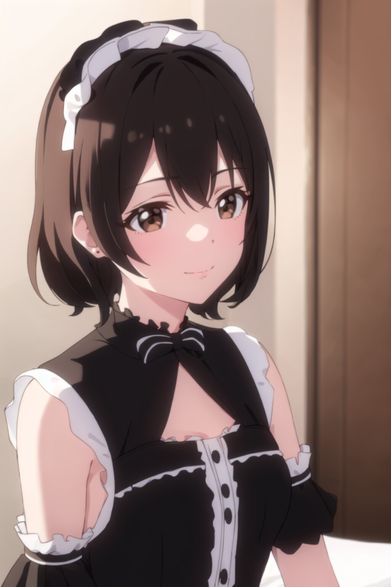
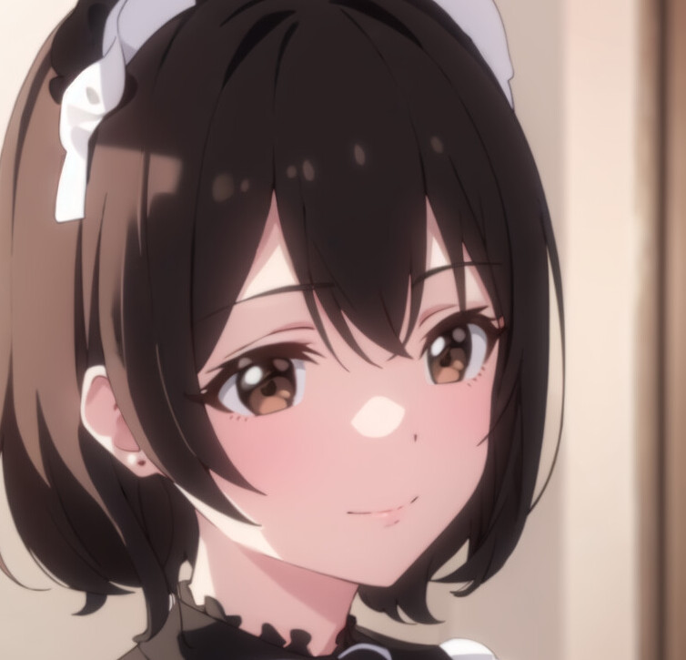

# 画像切り取りちゃん🎈
  
pythonわからん奴が作った奴だから相当怪しい  
  
pythonは3.11以降でオナシャス  
  
setup.bat使えばvenv使るよ(venvで作った環境が3.11以降か注意してね)  
そのあとrun.bat使えば動くよ、多分  
  
設定はconfig.toml書き換えてね  
細かいことはconfig.tomlに書いた  
  
## 大体こんな感じ  
画像をinputフォルダに放り込む  
  
  
run.batを使うと切り取ってoutputフォルダに出力してくれる  
  
  
config.tomlの中のdebugをtrueにして実行するとデバック画像がdebugフォルダにでりゅうう🎈🎈🎈  
緑枠が発見した顔の部分  
赤枠が実際に切り取る部分  
赤枠のサイズはconfig.tomlのface_scale何とかで変えられるよ！  
  
